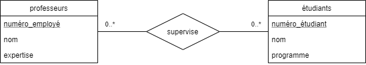
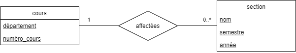
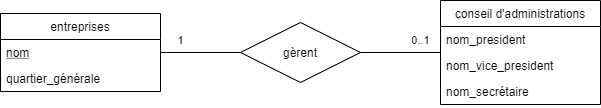
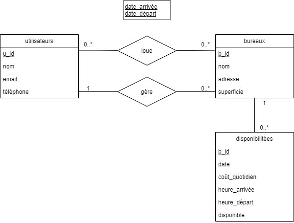

# CSI 2532 - Devoir 1 

## Groupe:
Thierry Laprade #300067788

## Partie A: Modèles E-R

### A1: Relations, Cardinalité et participation
a) **[5 points]** Un étudiant peut être supervisé par plusieurs professeurs, et un professeur peut
superviser plusieurs étudiants. Un étudiant a un numéro d'étudiant, un nom et est inscrit dans
un programme spécifique. Un professeur a un numéro d'employé, nom et domaine d'expertise.



b) **[5 points]** Toutes les sections de cours doivent être affectées à un cours. Un cours a un code de département (par exemple CSI ou SEG) et un numéro de cours (par exemple 2532 ou 4105). Une section de cours est défini uniquement par le nom de la section (par exemple A ou B ou C), semestre (par exemple hiver), l'année et le cours lui-même. Une section de cours dépend sur le cours.



Note: j'assume qu'un cours peut ne pas avoir de section durant un semestre particulier (exemple: été 2021).

c) **[5 points]** Une entreprise a un nom et un quartier général (spécifié par pays). Un conseil d'administration a un président, un vice-président, et secrétaire (juste leurs noms). Une entreprise peut avoir au plus un conseil administrateurs (mais il n'en a pas besoin). Tout les conseils d'administration doivent avoir une et une seule entreprise à gérer.



### A2: Conception du Système

On vous demande de concevoir une base de données (à l'aide d'un diagramme relationnel) CorporateBnB, une entreprise qui permet à toutes les personnes ayant un bureau à domicile de fournir des espaces de réunion à d'autres. Tous les utilisateurs peut s'inscrire à ce service en fournissant leur nom, email et numéro de téléphone. Un utilisateur peut gérer un espace de bureau, ou peut louer un espace de bureau. Un bureau a un nom, une adresse et une superficie totale (en pieds carrés). Chaque bureau a la disponibilité pour quand il peut être loué. La disponibilité stocke la date et le coût quotidien pour l'utilisation, les heures d'arrivée et de départ et si cette date est toujours disponible. Lorsqu'un utilisateur loue une propriété, on stock la date d'arrivée et la date de départ. 

Modélisez le système ci-dessus à l'aide d'un diagramme Entité-Relation. Vous devez inclure les entités, les relations, la cardinalité, la participation et les attributs. Vous n'avez pas besoin de spécifier les types d'attributs (c'est-à-dire le domaine).




### A3: Algèbre relationnelle
a) **[7 points]** Trouvez tous les espaces de bureau à Ottawa qui sont disponibles le 2 mars 2020.

Pour la birèvité de cette expression, je concidère 'bureaux' comme 'b' et 'disponibilitées' comme 'd'.

**π** b.nom, b.adresse, b.superficie (**σ** d.date = '2020-03-02' **^** d.disponible = true **^** b.b_id = d.b_id (b **X** d))

b) **[8 points]** Trouvez tous les utilisateurs (nom et email) et les détails de la propriété (nom et ville) et les informations de location (date et coût quotidien) de toutes les bureaux loués du mois de janvier 2020.

Pour la birèvité de cette expression, je concidère 'utilisateurs' comme 'u', 'loue' comme 'l', 'bureaux' comme 'b' et 'disponibilitées' comme 'd'.

**π** u.nom, u.email, b.nom, b.adresse, d.date, d.coût_quotidien 

(**σ** l.date_arrivée < '2020-02-01 **^** l.date_départ > '2019-12-31)

(**σ** l.u_id = u.u_id **^** l.b_id = b.b_id **^** b.b_id = d.b_id (((u **X** b) **X** l ) **X** d))


J'ai séparer la requête en trois partie afin de mieux la comprendre et l'expliquer. Pour bien l'expliquer, je vais commencer par la troisième partie. Cette troisième partie sera ensiute donner a la deuxième partie. Finalement la deuxième partie sera donner a la première:

La troisième partie est le produit cartésien des 'utilisateur', des 'bureaux', des 'loue' et des 'disponibilitées'. Ensuite je m'assure que ce produit ne contient seulement des données où le lien utilisateur et bureaux on loue en commun (les Foreign key dans 'loue' coresponde avec les primiary key de 'utilisateurs' et 'bureaux'). Finalement je m'assure que la foreign key 'b_id' de 'disponibilitées' corespond avec la primary key 'b_id' de 'bureaux'. Ceci pourait techniquement etre concidérer une jonction naturelle des tables.

La deuxième partie s'assure que la date dans loue est en janvier. (si la date d'arriver est plus petit que le premier Février et la date de départ est plus grande que le 31 Décembre).

La première partie est la sélection de tous les éléments demander.

Voici la combinaison de ces partie:

**π** u.nom, u.email, b.nom, b.adresse, d.date, d.coût_quotidien (**σ** l.date_arrivée < '2020-02-01 **^** l.date_départ > '2019-12-31 (**σ** l.u_id = u.u_id **^** l.b_id = b.b_id **^** b.b_id = d.b_id (((u **X** b) **X** l ) **X** d)))

## Partie B: SQL

### B1: Lecture de requêtes SQL
a) **[4 points]**

Requête :
```sql
SELECT
  name,
  EXTRACT(year from age(users.join_date)) AS experience
FROM users
JOIN licenses ON licenses.user_id = users.id
WHERE licenses.software_name = 'MS Word'
ORDER BY users.name;
```

Résultat :
| name | expirience |
| ---- | ---------- |
| andrew | 3 |
| august | 1 |
| hayden | 2 |

Donc dans cette sortie on veut tous les utilisatueur qui utilise 'MS Word' et le nombre d'années depuis qu'il utilise le logiciel. (on extrait l'année du nombre de temps depuis que l'utilisateur a rejoint)

b) **[4 points]**

Requête :
```sql
SELECT name,
    released_date
FROM softwares
WHERE released_date < '2018-01-01'
ORDER BY released_date ASC;
```

Résultat :
| name | released_date |
| ---- | ------------- |
| MS Word | 2011-01-20 |
| Sketch | 2016-06-15 |

Donc dans cette requête on veut tous les logicielles avec une 'released_date" de moins que '2018-01-01' et on les trie par date de sortie.

c) **[7 points]**

Requête :
```sql
WITH users_2019 (id, name) AS
    (SELECT *
     FROM users
     WHERE join_date BETWEEN '2019-01-01' AND '2019-12-31')
  SELECT id,
         name,
         count(licenses.access_code) AS num
FROM users_2019
LEFT JOIN licenses ON licenses.user_id = id
GROUP BY name
ORDER BY num DESC;
```

Donc le WITH nous donne tous les utilisateur qui on rejoint en 2019. Ensuite on veut le nombre de liscences de ses utilisateurs. Cependant puisque l'on group par nom, il pourait y avoir des duplication de id qui aurait aussi besoin d'être grouper. Donc on a qu'a enlevé id de la sélection et on obtient :

Nouvelle Requête :
```sql
WITH users_2019 (id, name) AS
    (SELECT *
     FROM users
     WHERE join_date BETWEEN '2019-01-01' AND '2019-12-31')
  SELECT name,
         count(licenses.access_code) AS num
FROM users_2019
LEFT JOIN licenses ON licenses.user_id = id
GROUP BY name
ORDER BY num DESC;
```

Résultat :
| name | num |
| - | - |
| hayden | 1 |

### B2: Écriture de requêtes SQL

a) **[3 points]** Trouvez les noms de tous les utilisateurs qui se sont inscrits avant le 1er janvier 2020.

Requête:
```sql
SELECT * 
FROM users
WHERE join_date < '2020-01-01';
```

Résultat :
| id | name | total_liscences |
| - | - | - |
| 48 | andrew | 2018-01-01 |
| 49 | hayden | 2019-01-02 |

b) **[5 points]** Trouvez le nombre de licences logicielles de chaque utilisateur (même celles sans licence). Triez les résultats par nombre de licences (du plus au moins), puis par nom (A - Z).

Requête:
```sql
SELECT users.name, count(licenses.user_id) as total_liscences
FROM users
LEFT JOIN licenses ON licenses.user_id = id
GROUP BY users.name
ORDER BY total_liscences DESC, name ASC;
```

Résultat :
| name | total_liscences |
| - | - |
| andrew | 2 |
| august | 1 |
| ayana | 1 |
| hayden | 1 |

c) **[5 points]** Insérez des données dans la base de données pour démontrer que les résultats sont triés correctement en (b).

```sql
INSERT INTO users (id, name, join_date)
VALUES
    (1, 'thierry', '2021-01-01'),
    (2, 'kevin', '2021-02-01'),
    (3, 'aaron', '2021-01-04');

INSERT INTO licenses (user_id, software_name, access_code)
VALUES
    (1, 'MS Word', '132pass'),
    (1, 'Sketch', '123pass'),
    (2, 'MS Word', 'hello'),
    (3, 'MS Word', 'hi');
```

Résultat :
| name | total_liscences |
| - | - |
| andrew | 2 |
| thierry | 2 |
| aaron | 1 |
| august | 1 |
| ayana | 1 |
| hayden | 1 |
| kevin | 1 |

On remarque que 'thierry' et 'kevin' on des id plus haut que le reste, donc il devrait être plus haut que 'andrew' et 'august' respectivement dans le tableau mais puisque leur nom est plus bas que eux il se retrouve plus bas. (Ceci assume qu'il sont insérer en ordre de id). On remarque aussi que 'aaron' (si on concidère qu'il est insérer après le reste) devrait se retrouver dans la dernière rangé mais puisque que sont nom est le plus haut et qu'il n'a seulement qu'une license, il se retrouve a la troisième ranger.

d) **[2 points]** Mettez à jour la version de sketch à la version "51" (publié le 1 janvier 2020).

```sql
UPDATE softwares
SET version = 51, released_date = '2020-01-01'
WHERE name = 'Sketch';
```

Résultat: (avec un requête `SELECT * FROM softwares`)
| name | version | released_date |
| - | - | - |
| MS Word | 2012 | 2011-01-20 |
| Chrome | v84 | 2018-01-01 |
| Sketch | 51 | 2020-01-01 |

### B3: Mise à jour de schéma SQL
a) **[5 points]** Ajoutez la version du logiciel à la table des licences.

```sql
ALTER TABLE licenses
ADD COLUMN version varchar(100);
```

b) **[5 points]** Mettez à jour la table des softwares pour inclure le nom ET la version comme clé primaire.

```sql
BEGIN;
ALTER TABLE softwares
DROP CONSTRAINT softwares_pkey;

ALTER TABLE softwares
ADD PRIMARY KEY (name, version);

ALTER TABLE licenses
ADD FOREIGN KEY (software_name, version) REFERENCES softwares (name, version);
COMMIT;
```


c) **[10 points]** Mettez à jour le tableau des licences pour permettre aux utilisateurs d'avoir plusieurs versions du même logiciel. Pour démontrer cela, ajoutez Sketch 52 à l'utilisateur "andrew" avec le code d'accès "xxxyyy111". Ne codez pas directement avec l'ID de utilisateur,
cela devrait fonctionner pour n'importe quelle instances de la base de données avec un utilisateur nommé "andrew".

Puique Version deviendra une clé primaire, j'ai besoin d'inserer des valeurs dans la colone de version de licenses: 

```sql
UPDATE licenses
SET version = '2012'
WHERE software_name = 'MS Word';

UPDATE licenses
SET version = 'v84'
WHERE software_name = 'Chrome';

UPDATE licenses
SET version = '49'
WHERE software_name = 'Sketch';
```

Migration:
```sql
BEGIN;
ALTER TABLE licenses
DROP CONSTRAINT licenses_pkey;

ALTER TABLE licenses
ADD PRIMARY KEY (user_id, software_name, version);
COMMIT;
```

Maintenant, nous pouvons ajouter les nouveaux logiciel que nous avions initialement essayer d'ajouter:

```sql
INSERT INTO softwares (name, version, released_date)
VALUES
    ('MS Word', '2020', '2019-06-15'),
    ('Chrome', 'v92', '2020-01-01'),
    ('Sketch', '52', '2020-02-11');
```

Exemple:
```sql
INSERT INTO licenses (user_id, software_name, version, access_code)
SELECT id,
    'Sketch',
    '52',
    'xxxyyy111'
FROM users
WHERE name = 'andrew';
```

d) **[10 points]** Sketch propose une promotion (code d'accès "1monthfree") pour la version 52. Donnez cette licence à tous ceux qui ne l'ont pas encore, leur permettant de conserver toute ancienne version qu'ils pourraient avoir. Ne codez pas directement la liste des utilisateurs, cela devrait fonctionner pour n'importe quelle instances de la base de données.

```sql
INSERT INTO licenses (user_id, software_name, version, access_code)
SELECT users.id,
    'Sketch',
    '52',
    '1monthfree'
FROM users
WHERE id != ALL (
SELECT id
    FROM users
    LEFT JOIN licenses ON licenses.user_id = id
    WHERE software_name = 'Sketch' AND version = '52');
```

Cette requête exécute une sous-requête qui retourne le id de toutes les utilisateurs qui ont déja le logiciel 'Sketch' avec version '52'. Ensuite, j'insert des nouvelle licenses a tout les utilisateur qui ne match pas les id dans la sous-requête.

Par exemple:

Lorsque l'on exécute cette commande (pour les données courrante du système) on obtient : 

```bash
INSERT 0 3
```

Mais si on re-roule la commande, on obtiendra :

```bash
INSERT 0 0
```